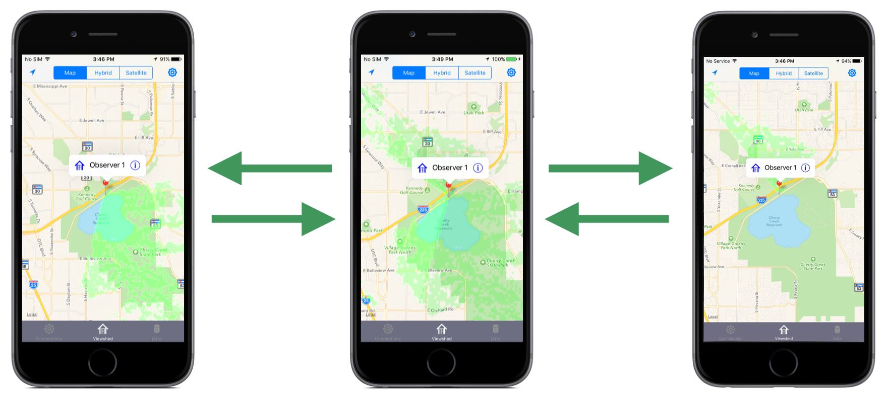

# Fog Machine Framework



Fog Machine is an iOS Swift framework for parallel processing.  Solve hard problems fast with the Fog Machine framework.

The Fog Machine framework is a research and development effort to harness the computing power of multiple, locally connected iOS devices.  By using a mesh-network of mobile devices, parallel processing techniques allows Fog Machine to analyze data and answer complex questions quickly and efficiently.  Parallel processing over mesh networks reduces the overall time to solve problems by taking advantage of shared resources (processors, memory, etc.).  The communication relies on a wifi or bluetooth chipset and is built on apple's multipeer connectivity framework.

There are two demos apps.  The first simple demo app distributes searching for a word in a given text.  The second app calculates the viewshed of a position.  A viewshed is the geographical area that is visible from a location. It includes all surrounding points that are in line-of-sight with that location and excludes points that are beyond the horizon or obstructed by terrain and other features.

FogMachine was developed at the National Geospatial-Intelligence Agency (NGA) in collaboration with BIT Systems. The government has "unlimited rights" and is releasing this software to increase the impact of government investments by providing developers with the opportunity to take things in new directions. The software use, modification, and distribution rights are stipulated within the Apache license.

## Build

Fog Machine uses CocoaPods for dependency management.   

Install all dependencies:
```bash
Pod install
```

## Usage

The Fog machine framework provides a simple lifecycle for your app to use.

```swift
// Connect
ConnectionManager.start()
```

# Requirements

Fog Machine requires iOS 8+.

## Pull Requests

If you'd like to contribute to this project, please make a pull request. We'll review the pull request and discuss the changes. All pull request contributions to this project will be released under the Apache license.

Software source code previously released under an open source license and then modified by NGA staff is considered a "joint work" (see 17 USC § 101); it is partially copyrighted, partially public domain, and as a whole is protected by the copyrights of the non-government authors and must be released according to the terms of the original open source license.

## License

Copyright 2016 BIT Systems

Licensed under the Apache License, Version 2.0 (the "License");
you may not use this file except in compliance with the License.
You may obtain a copy of the License at

http://www.apache.org/licenses/LICENSE-2.0

Unless required by applicable law or agreed to in writing, software
distributed under the License is distributed on an "AS IS" BASIS,
WITHOUT WARRANTIES OR CONDITIONS OF ANY KIND, either express or implied.
See the License for the specific language governing permissions and
limitations under the License.

## Acknowledgements

Fog Machine makes use of the following open source projects:
- **PeerKit**  
This product includes software licensed under the MIT License http://opensource.org/licenses/mit-license.php
